## Intro

This is my write up for the Pickle Rick room on tryhackme.com

## Recon

I start off with a quick nmap scan to get things off the ground
`nmap -sC -sV 10.10.204.14`

Looks like Apache is running on the box (possible vulnerable version?) and an SSH server is running on the box:
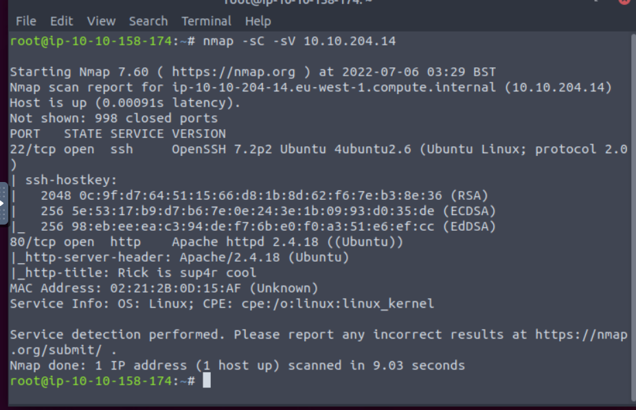

I check up on the server via browser, and there's a home page to help Rick get 3 ingredients to turn him back from a pickle to a man:
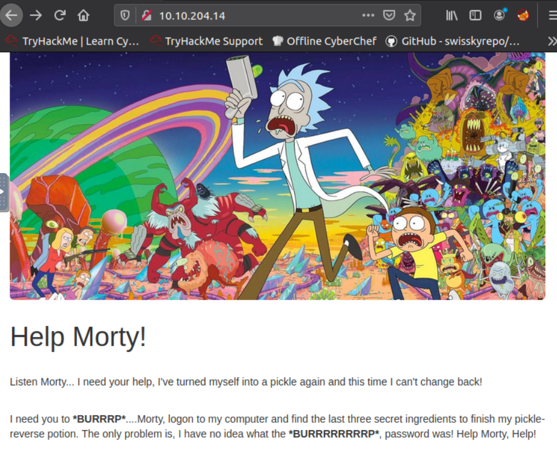

If you check the page source on the index page, there's a comment that leaks the username
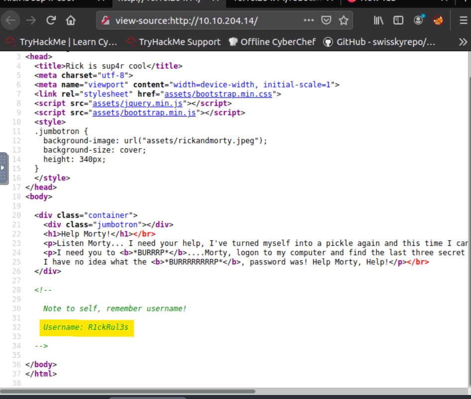

I run gobuster to look for some possible directories, and the only one I'm finding so far is /assets, which just brings up a directory of files
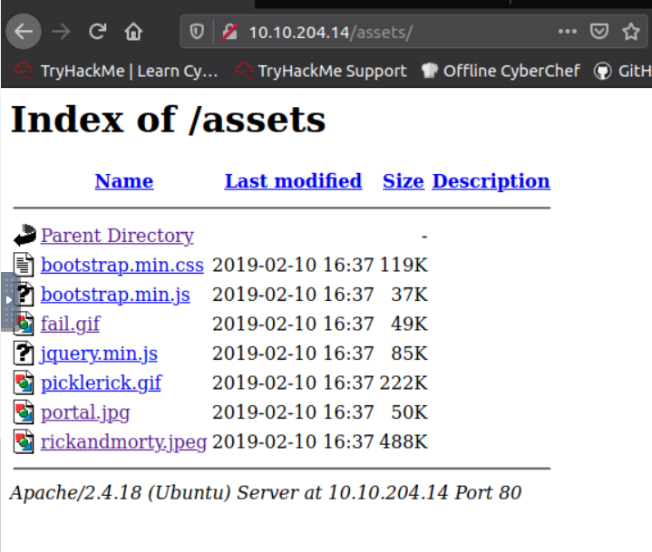

I also check the robots.txt and the only entry is
"Wubbalubbadubdub"

After looking around a bit more, I try nikto to see if there's anything that comes up that was missed by nmap and gobuster.

There's another link missed by gobuster, a login.php:
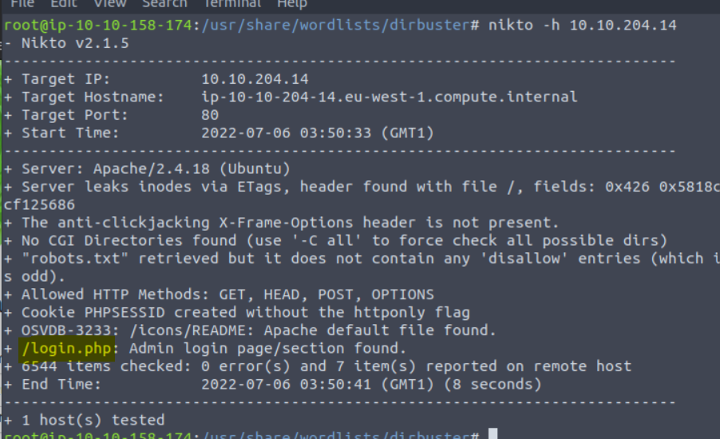

You go to the /login.php, and there's an admin login form:
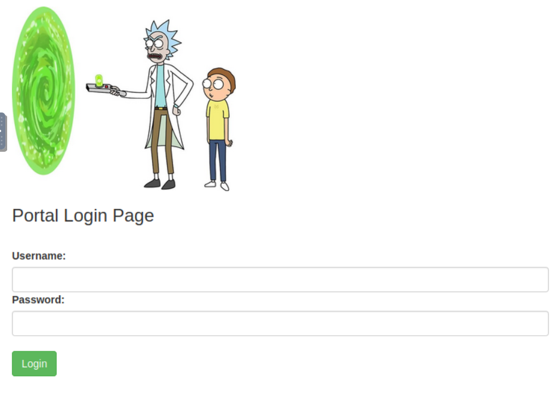

## Testing login and Enumeration

We now have a login page, a leaked username, so we can start checking passwords. I'm thinking the robots.txt entry might have been a possible password, so I try the username password combo, and I'm able to get into the admin side!

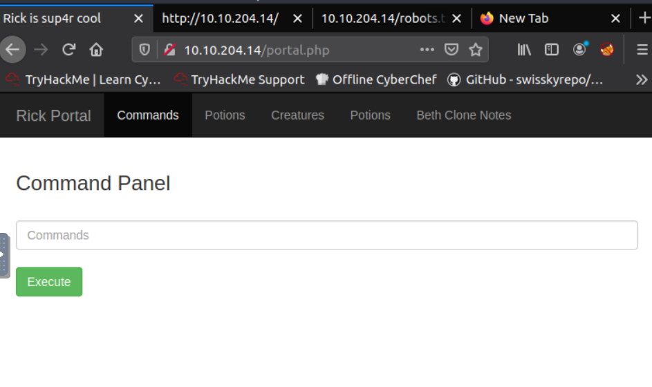

There's a text box for a "Command Panel", so I try entering "ls" to see if it responds to any system commands. I can now see some of the files visible from where the commands panel is looking:

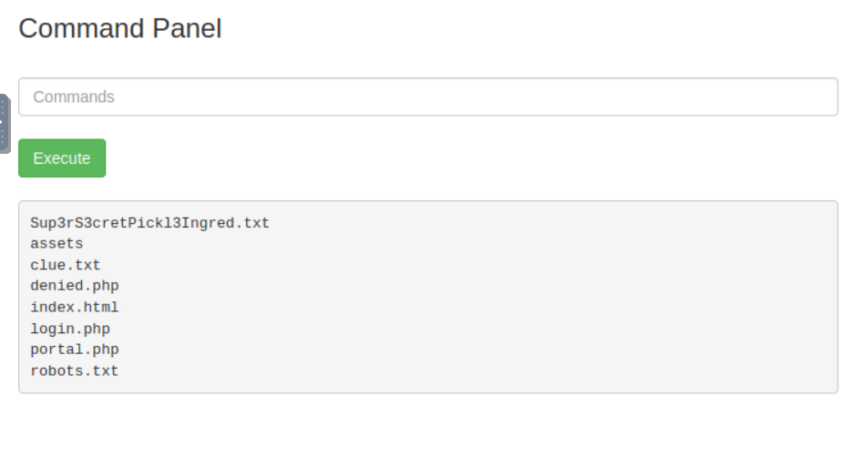

Looks like one of the files has the ingredients I'm looking for, Sup3rS3cretPickl3Ingred.txt!

I try running "cat Sup3rS3cretPickl3Ingred.txt" into the command panel, but looks like the cat command is disabled through the panel:
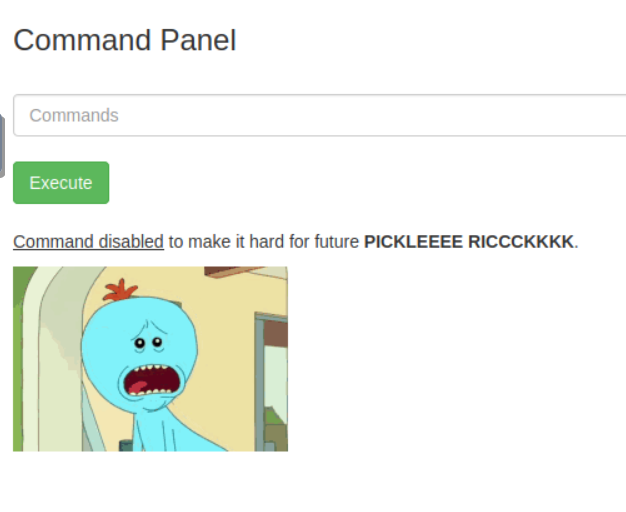

From looking at some of the other files (robots.txt, login.php index.html), it looks like the command panel is running under the same directory as the rest of the sitefiles, so I should be able to browse through the rest of the files with the file browser!

Let's try with Sup3rS3cretPickl3Ingred.txt
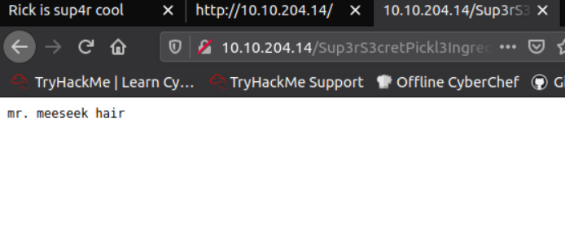

First flag found!

## Second Flag

Ok, with the first flag done, let's look around in the portal a little more.
When you're logged in with the username that was stored in the index.html page, there are some extra menu links (Commands, Potions, Beth's Clone Notes, etc.), but the links in the menu are all setup to go directly to denied.php. This is making me think there's an additional login, and on the login page, a flag gets set on whether you're the "real rick" or not.

I check the page source on portal.php, and there's a base64 encoded string in the comments:
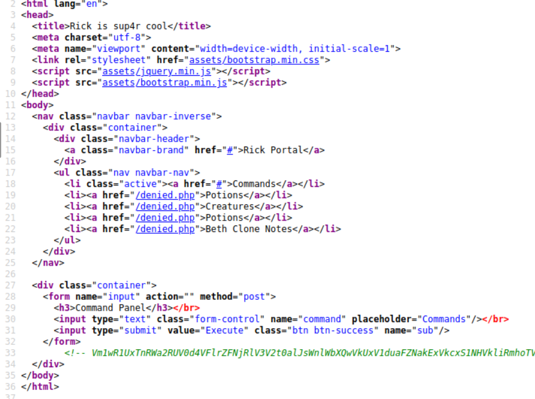

I check through to see if I decode this string, but I'm not finding anything. Then for a moment I thought that it might be an SSH key, since theres an SSH service running on this box, and when I tried to SSH I needed a key. Unfortunately, after saving the text to a key file and trying to ssh in, I still ran into the same issues, whether trying to log in as root or ubuntu.

I'm thinking this must be some sort of session Id or something, but unfortunately I'm just not really getting anywhere with this string of text. I'll come back to this later.

Moving back to the command center, it looks like other than cat and a few other commands, I can pretty much run anything in here and view the results. Lets see if I can chain multiple commands together and do some directory traversal. I'm going to try to see if I can go to the main directory

`cd ../../../../; ls -al`

technically I could run this as one command (ls ../../../../) but this killed two birds with one stone! Running this in the Command Panel brings me here:
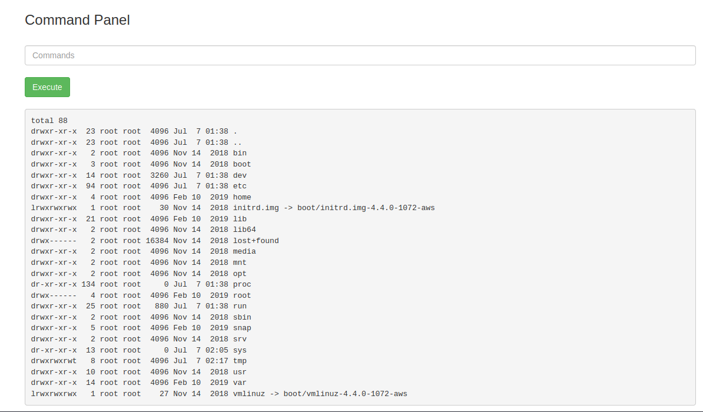

Looks like I have access to the home folder, maybe I can see if there's another user that has additional info

`cd /home; ls -al`
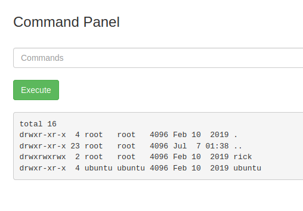

Ahhh, there's a rick user! Lets see if there's anything the rick user has that would come in handy!

`ls -al /home/rick`
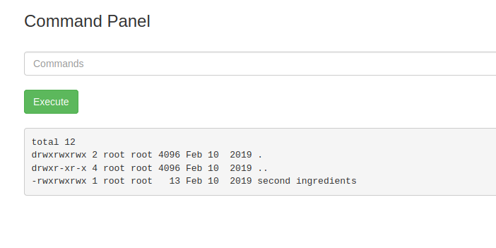
Second ingredients!

Normally I would just run `cat "/home/rick/second ingredients"` and call it a day, but the cat command is being blocked by the panel....

I messed around with echo for a little while seeing if I could echo the contents of the file, but I had completely forgotten about less! The less command lets you page through a text file and displays a screenful of text at a time. Lets give it a try!

`less /home/rick/"second ingredients"`

You have to add the double quotes around the filename so that the text file is recognized as having a space in the filename.
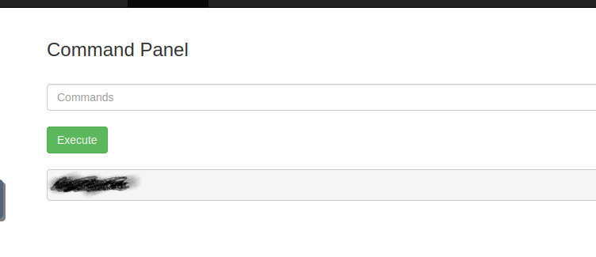
I blanked out the answer, but this did the trick! Now onto the third ingredient

## Third Flag

After finding this flag, I was starting to think that I should try once more to SSH into the box to see if there's anything I might be missing. I tried the same trick with using the string of characters in the comments I had found earlier as a key, but using the rick username. Unfortunately I still could not SSH into the box, so I think the string of text in the page source was some sort of dead end.

After realizing I could use the less command, I started playing around with this for a little while to see if I could find any logic gaps in some of the php files. The returned results are a little ugly, but the page source still works!
Here's the body of login.php
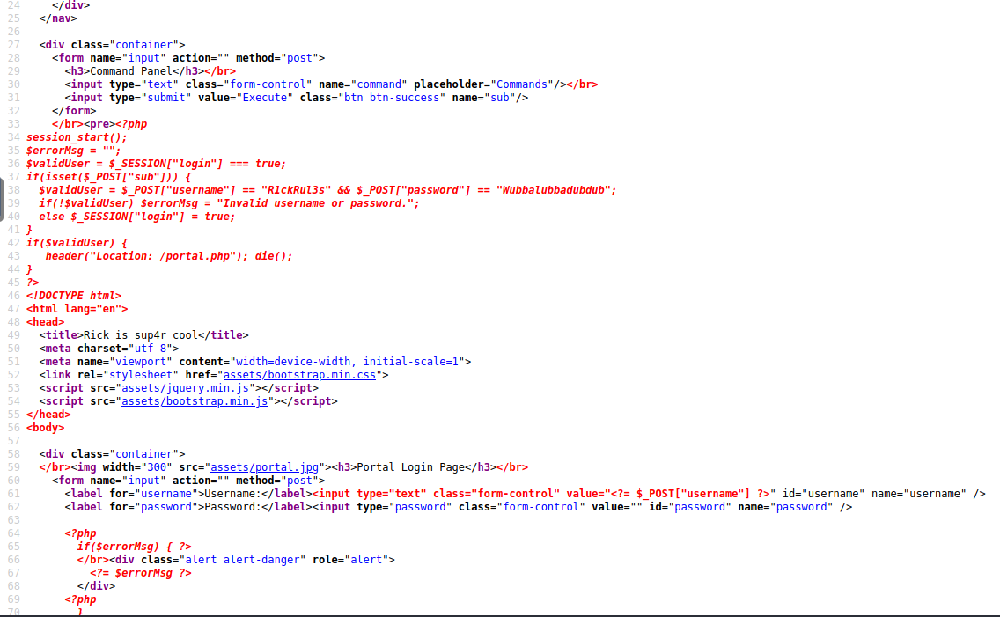
So from looking at this, you can see that the login page only looks for the username and password we used, so my earlier theory of there being some sort of superadmin user login to get to this page with different permissions doesn't look right.

Here's the body of portal.php:
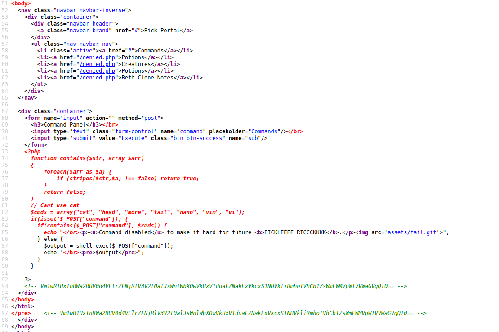
You can see that the panel checks to make sure you aren't using cat, head, more, tail, nano, vim, or vi, which is how we were able to use less!

At this point, I noticed there weren't any restrictions I could see as far as trying to run commands as root (sudo)

I double checked what user the command panel ran under, to see if there was something different
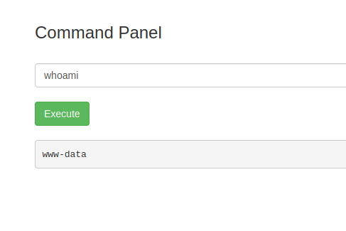

When doing this though, I noticed that I was able to run this same command prepended with sudo and my user had sudo privileges!

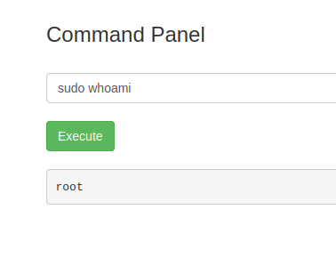

Thinking this through, that means as long as I avoid the commands the panel checked, I could pretty much run any command or look anywhere on the box I wanted!

With this in mind, I immediately went over to /root, to see if there was anything there.

`sudo ls /root`
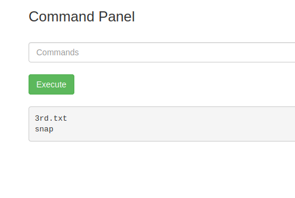

There's our third ingredient, just time to print this out, and we're all wrapped up!
`sudo less /root/3rd.txt`
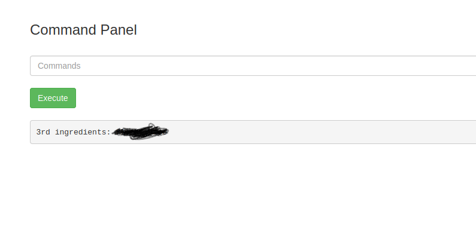

All Set!!
